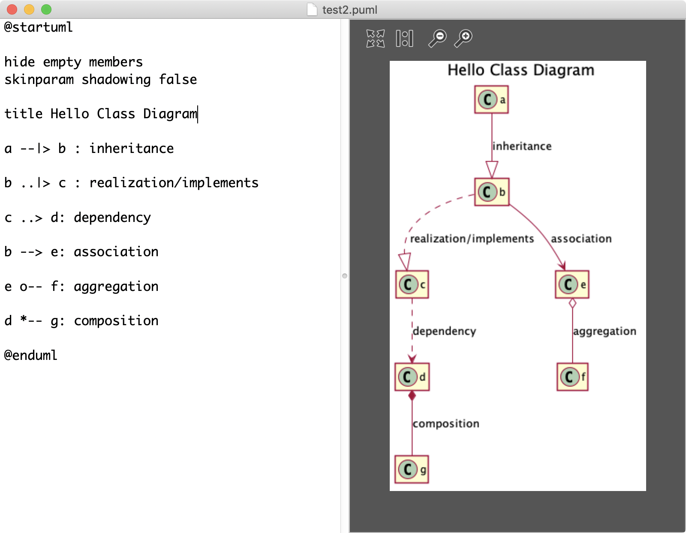

# PlantText - Mac Native application

## Idea

Simple two pane UI with editor and live preview plantuml text with image output. OSX Native application, quicker preview (with Java Nailgun Server)

## MVP ~~TODO~~

  - [x] Editor & Viewer UI
  - [x] ~~Config - nailgun/jar config~~ bundle both jars
  - [x] Live Preview
  - [x] ~~Option to save image~~ autosave same path as source 

 

## Backlog

  - [ ] Auto-download nailgun and plantuml jar on initial launch
  - [ ] Syntax highlighting
  - [ ] Objects & Ref UI
  - [ ] Files Directory - treeview UI
  - [ ] Output folder - auto save
  - [ ] Themes
  - [ ] Font

## Dependencies  Credits

* [PlantUML](http://plantuml.com/)
* [NailGun Server](http://www.martiansoftware.com/nailgun/)
* [ZRRImageView](https://github.com/Zorroa/ZRRImageView)
* [PlantText*](https://www.planttext.com/) for inspiration 